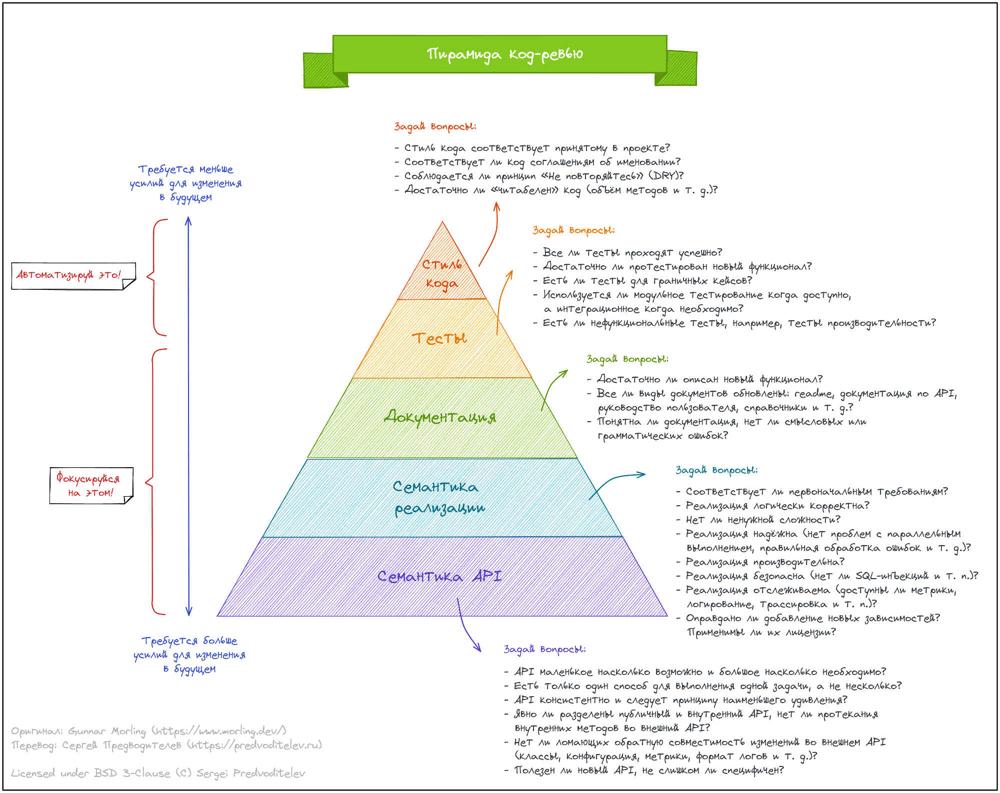

# Code Review. The Best Practice
Доклад: https://youtu.be/HSneeu5pKBs  
Презентация: https://docs.google.com/presentation/d/1923kJ2W6LZ7pGGTPPxY2IEVHXm_R3IvwjhgkXACZDZY/

## На что смотреть
Пирамида code review
https://habr.com/ru/companies/productivity_inside/articles/664566/

Вопросы (от самого важного к менее важному):
1. Решает ли код задачу?
    1. Прочитал ли я описание задачи?
    2. Понимаю ли я задачу?
    3. Понимаю ли я, как примерно её решать?
    4. Код похож на примерное решение?
2. Решает ли код только эту задачу?
3. Норм ли АПИ?
4. Документация есть? Поправлена?
5. Уязвимости?
    1. Самые рентабельные уязвимости простые.
    2. Часть выявит статанализ.
    3. Для сложных нужен понимающий человек в команде.
6. Производительность?
    1. Сложность алгоритма.
    2. Использование внешних систем.
    3. Тяжелые запросы.
7. Race condition?
8. Можно проще?
9. Тесты
    1. Есть ли тесты?
    2. Понятны ли тесты?
    3. Покрыто ли всё важное?
10. Автоматизируй это!
    1. Форматирование кода.
    2. Запуск тестов.
    3. Статанализ.
    4. Описки и стиль текста.
    5. Безопасность.
    6. …

## Психологические аспекты
1. Принятие критики
    1. Защита — нормальная реакция на критику.
    2. Повелительное наклонение — зло.
    3. Не допускайте "наездов".
    4. Критикуешь — предлагай!
2. Хаки
    1. Общение голосом с фиксированием итогов.
    2. Автоматизировать проверку стиля кода.
    3. Решение автора должно победить.
    4. Не заваливаем сразу тучей мелочей.
    5. Откладываем холивары.

## Проблемы и решения
1. Скудные комменты
    1. Не скупиться.
    2. Скупой платит дважды (как минимум).
2. Пропускаем важные штуки на ревью
    1. Зарылись в мелочах.
    2. bus factor = 1. Лид устал.
    3. Слишком большие pull request.
    4. Нет аннотации или линка на задачу.
3. Задержки в итерациях (туда-сюда)
    1. Устно договориться и записать.
    2. Поправить в pull request.
4. Куча архитектурных косяков
    1. Техническое ревью перед написанием кода.
    2. Промежуточные code review.
5. Code review стопорит команду
    1. У нас bus factor.
    2. Устроить peer review.
6. Недостаточно опыта для peer review
    1. Code review шарит знания.
7. Тяжко на review бегать по коду
    1. Откройте код в IDE.
    2. Лист бумаги + ручка.

## Соглашения
1. Все спорные решения оформляются в соглашения.
2. Ведётся в git или wiki.
3. Ссылаемся на них на ревью.
4. Автоматизируем.

## Когда Code Review не нужен
1. Если дешевле без него
    1. Не нужно качество.
    2. Есть возможность фиксить проблемы «на лету».
    3. Нет действительно сложной логики.
2. Если не можете его сделать нормально
    1. Смотрят поверхностно.
    2. Обижают и обижаются.
    3. Лид устал, команда не хочет.

# Итого
1. На что смотреть.
2. Психологические аспекты.
3. Проблемы и решения.
4. Соглашения.
5. Когда Code Review не нужен.
